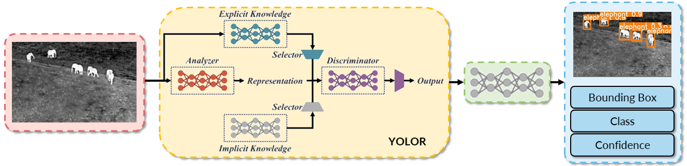

# :elephant: ROB498 - Wildlife Protection Through Aerial Drone Surveillance
The goal of our project was to build a detection system that can recognize animals in thermal infrared aerial images. We investigated YOLOR and YOLOv5, and performed several experiments on the [BIRDSAI](https://sites.google.com/view/elizabethbondi/dataset) dataset before arriving at our final design, shown in the figure below. The final prototype exceeded our design requirement with a mAP of 38.2\% and is well within the hardware constraints of the GPU assumed to be available on the UAV. More details can be found in our [report](assets/ROB498_Final_Report.pdf).
<p align="center"></p>

## :open_file_folder: Repository Structure 
<details open>
<summary>[Click to view]</summary>

```
ROB498/
│   README.md
|   .gitignore
|   LICENSE
└───setup/
    └───docker/
        |   Dockerfile, build_docker.sh, run_docker_gpu.sh, run_docker.sh, py_interpreter.sh
└───data/
    │   convert_birdsai_to_coco.py -- script to convert BIRDSAI dataset to COCO format
    |   count_classes.py -- script to determine the number of samples in each object class
    |   Anchor_Statistics.ipynb -- K-means to determine anchors for YOLOR
    └───utils/ -- folder containing code for BIRDSAI data handling which we didn't use
    └───dataset/ (store dataset files here)
        └───TrainReal/
            └───annotations/
            └───images/
        └───TestReal/
            └───annotations/
            └───images/
        └───TrainSimulation/
            └───annotations/
            └───images/
        └───coco_format/ (data/convert_birdsai_to_coco.py will save outputs to this directory)
            |   TrainReal.json
            |   TestReal.json
            |   TrainSimulation.json
└───src/
    └───common/
        |   data_utils.py -- data-related utility functions shared between models
        |   general_utils.py -- general utility functions shared between models
    └───yolor/
        |   YOLOR specific code lives in this directory
    └───yolov5/
        |   YOLOv5 specific code lives in this directory
```
</details>

## :hammer: Environment Setup
<details open>
<summary>[Click to view]</summary>
To replicate the results in our report, we recommend using the Docker setup provided in this repository. All the relevant files are located in [`setup/docker`](setup/docker). To set this up, do the following:
```
$ cd setup/docker
```

### 1. Build the Docker image
Running the following command will build a docker image with the image name and tag specified in lines 4-5 of [`build_docker.sh`](setup/docker/build_docker.sh#l4). Modify this according to your preference. The default is currently set to `tiffanyyk/tiffanyyk:rob498-yolo`.
```
$ ./build_docker.sh
```
### 2. Start a Docker container
This will start a docker container using the image you have just built. If you changed the name of the docker image in [`build_docker.sh`](setup/docker/build_docker.sh#l4), modify lines 5-7 of [`run_docker_gpu.sh`](setup/docker/run_docker_gpu.sh#l5) accordingly.

```
$ ./run_docker_gpu.sh
```
If you have multiple GPUs (e.g. 4 GPUs), run the following instead:
```
$ ./run_docker_gpu.sh -gd 0,1,2,3
```

### Remote Debugging
If this is relevant to you, the [`py_interpreter.sh`](setup/docker/py_interpreter.sh) script is provided for remote debugging setup.

### Setup Notes
If you encounter any permission errors when building the image or running the docker container, use `chmod +x [build or run script]`.

</details>

## :clock2: Training and Testing YOLOR
<details open>
<summary>[Click to view]</summary>

```
# Training YOLOR with 2 classes on real data only
$ cd /path/to/repo/ROB498/src/yolor
$ python train.py --batch-size 16 --img 640 640 --data birdsai_2class.yaml --cfg cfg/yolor_p6_birdsai_2class.cfg --weights '' --device 0 --name yolor_final_prototype --hyp hyp.scratch.640.yaml --epochs 200

# Testing YOLOR with 2 classes on real data only
$ cd /path/to/repo/ROB498/src/yolor
$ python test.py --data birdsai_2class.yaml --img 640 --batch 32 --conf 0.001 --iou 0.65 --device 0 --cfg cfg/yolor_p6_birdsai_2class.cfg --weights /path/to/saved/checkpoint.pt --name yolor_final_prototype_test --verbose --names data/birdsai_2class.names

# Training YOLOR with 2 classes on real data only (Multi-GPU)
$ cd /path/to/repo/ROB498/src/yolor
$ python -m torch.distributed.launch --nproc_per_node 4 --master_port 9527 train.py --batch-size 16 --img 640 640 --data birdsai_2class.yaml --cfg cfg/yolor_p6_birdsai_2class.cfg --weights '' --device 0,1,2,3 --sync-bn --name "name_of_project" --hyp hyp.scratch.640.yaml --epochs 200
```

</details>

## :clock2: Training and Testing YOLOv5
<details open>
<summary>[Click to view]</summary>

```
# Training YOLOv5 with 2 classes on real data only
$ cd /path/to/repo/ROB498/src/yolov5
$ python train.py --batch 16 --data birdsai_2class.yaml --cfg yolov5n_birdsai_2class.yaml --weights '' --img 640 --device 0

# Testing YOLOv5 with 2 classes on real data only
$ cd /path/to/repo/ROB498/src/yolov5
$ python val.py --weights /path/to/saved/checkpoint.pt --data birdsai_2class.yaml --img 640 --task speed
$ python val.py --weights /path/to/saved/checkpoint.pt --data birdsai_2class.yaml --img 640 --task test
```
</details>

## :clipboard: Summary of Results
<details open>
<summary>[Click to view]</summary>

The following table shows the mAP achieved by YOLOR and YOLOv5 for our final experimental configurations.
| Architecture | mAP<sub>0.5 | mAP<sub>0.5:0.95 |
|------|------|------|
| YOLOR | 38.2 | 13.4 |
| YOLOv5 | 35.4 | 12.7 |

The following table shows the GFLOPs and inference speed on a single P100 GPU for YOLOR and YOLOv5.
| Architecture | GFLOPs | Inference Time (ms) | NMS (ms) | FPS (total) |
|------|------|------|------|------|
| YOLOR | 80.38 | 10.2 | 3.4 | 73.6 |
| YOLOv5 | 4.2 | 2.5 | 3.9 | 156.3 |
</details>

## :clipboard: Other Possible Configurations Provided
<details close>
<summary>[Click to view]</summary>
We provide an assortment of other possible configurations, for running experiments with different number of classes and reproducing results indicated in the report.

All configuration files are provided in the following locations:
```
ROB498/
└───src/
    └───yolor/
        └───cfg/
            |   yolor_p6_birdsai_2class_origanchors.cfg
            |   yolor_p6_birdsai_2class_origanchors_1channel.cfg
            |   yolor_p6_birdsai_3class.cfg
            |   yolor_p6_birdsai.cfg
        └───data/
            |   birdsai_2class.names
            |   birdsai_2class.yaml
            |   birdsai_3class.names
            |   birdsai_3class.yaml
            |   birdsai.names
            |   birdsai_10class.yaml
            |   hyp.finetune.1280
            |   hyp.scratch.1280
            |   hyp.scratch.640
    └───yolov5/
        └───data/
            |   birdsai_2class.yaml
        └───models/
            |   yolov5n_birdsai_2class.yaml
```

All commands should follow this format for training and testing on YOLOR:
```
# Training YOLOR with 2 classes on real data only
$ cd /path/to/repo/ROB498/src/yolor
$ python train.py --batch-size 16 --img 640 640 --data birdsai_{X}class.yaml --cfg cfg/yolor_p6_birdsai_{X}.cfg --weights '' --device 0 --name {NAME_OF_EXPERIMENT} --hyp hyp.{X}.yaml --epochs 200

# Testing YOLOR with 2 classes on real data only
$ cd /path/to/repo/ROB498/src/yolor
$ python test.py --data birdsai_{X}class.yaml --img 640 --batch 32 --conf 0.001 --iou 0.65 --device 0 --cfg cfg/yolor_p6_birdsai_{X}.cfg --weights /path/to/saved/checkpoint.pt --name {NAME_OF_EXPERIMENT} --verbose --names data/birdsai{X}.names
```

</details>

## :relaxed: Acknowledgements
We would like to thank the authors of [YOLOR](https://github.com/WongKinYiu/yolor) and [YOLOv5](https://github.com/ultralytics/yolov5) for open-sourcing their code.
